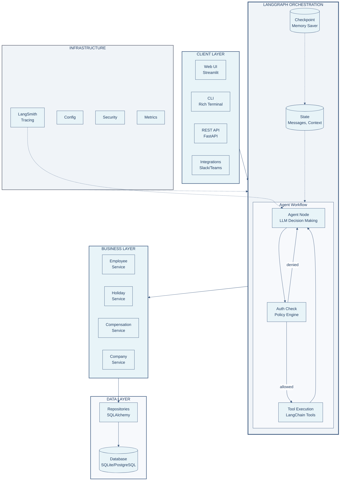
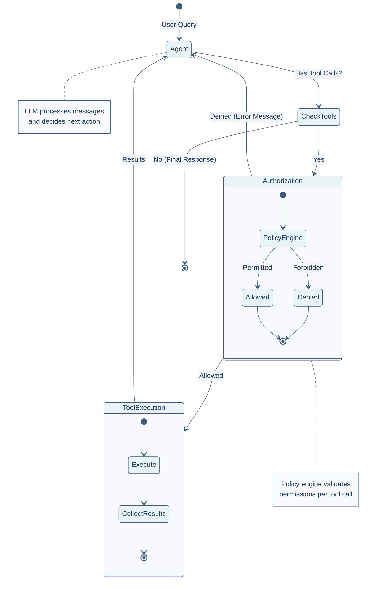
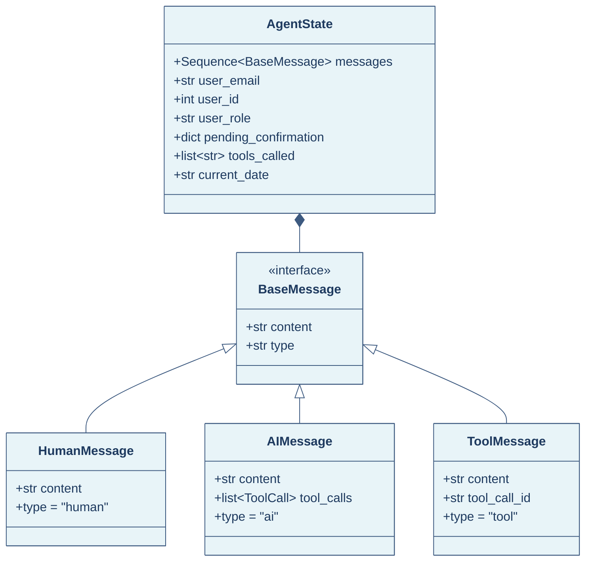
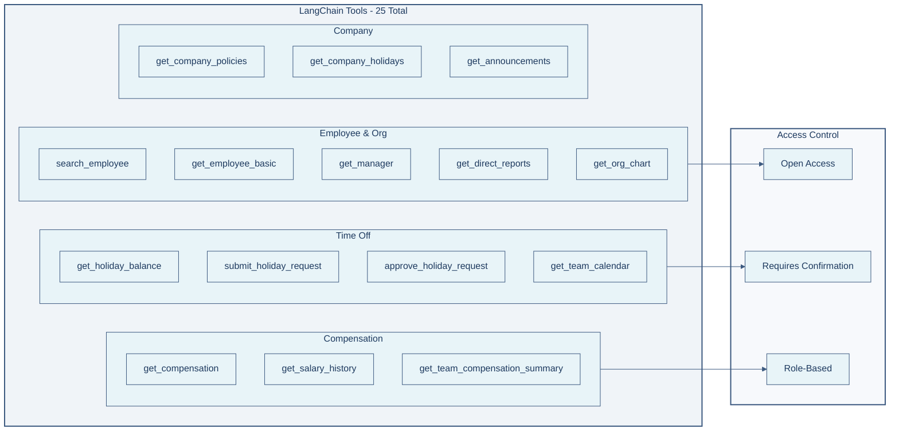
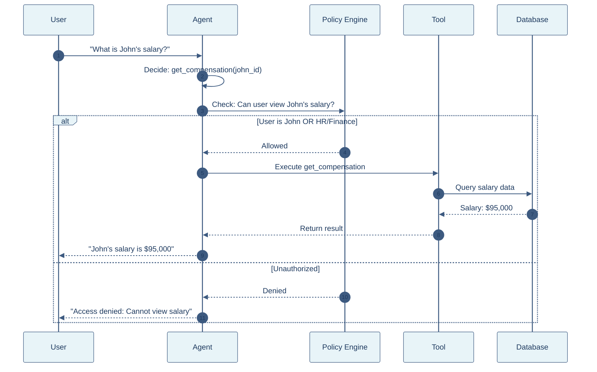

# HR Agent Architecture

> **Enterprise-grade HR Assistant powered by LangChain, LangGraph, and LangSmith**

---

## 🏗️ High-Level Architecture

---

## 🔄 LangGraph Workflow

The agent follows a **ReAct pattern** with policy-based authorization:

---

## 📊 State Management

---

## 🛠️ Tool Architecture

---

## 🔐 Authorization Flow

