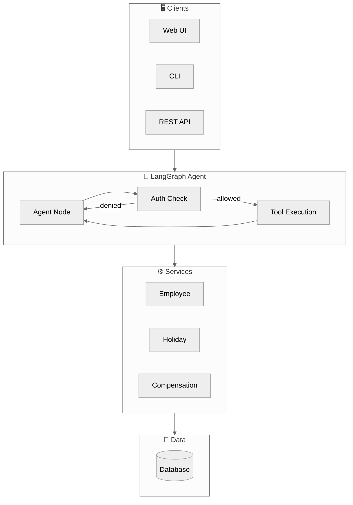
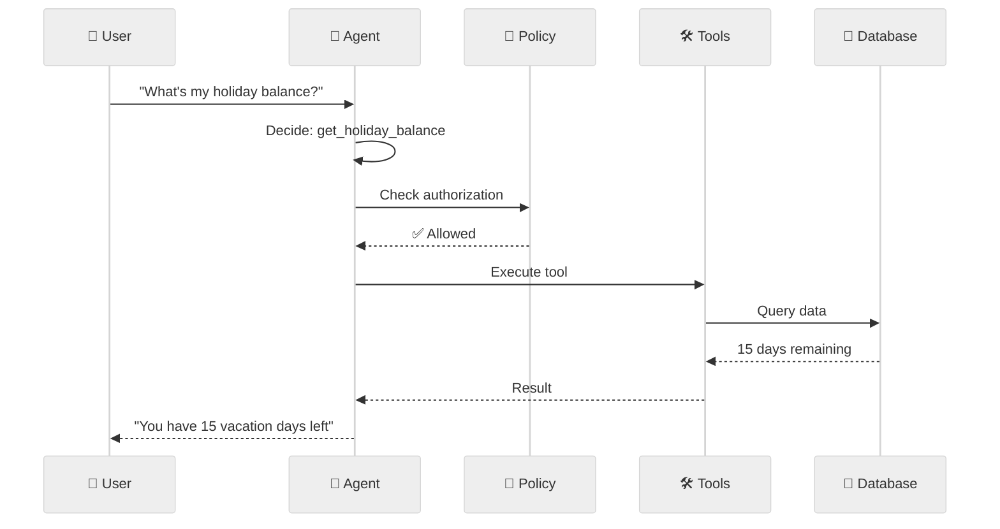
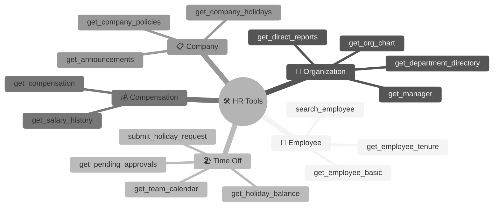

# HR Agent

<div align="center">


**A production-ready HR assistant demonstrating best practices in LLM agent design**

[Quick Start](#-quick-start) • [Architecture](#-architecture) • [Features](#-key-features) • [Evaluation](#-evaluation)

</div>

---

## 🚀 Quick Start

```bash
# Clone and setup
git clone <repository-url>
cd hr-agent

# Install uv (if not already installed)
curl -LsSf https://astral.sh/uv/install.sh | sh

# Install dependencies with uv
uv sync

# Configure
cp .env.example .env
# Edit .env with your LLM API key

# Run the Web UI
uv run streamlit run apps/web/app.py

# Or run the API server
uv run uvicorn apps.api.server:app --reload
```

---

## ✨ Key Features

| Feature | Description |
|---------|-------------|
| 🔄 **LangGraph Workflow** | Stateful agent with conditional routing and message history |
| 🛠️ **LangChain Tools** | 25 HR tools with Pydantic validation |
| 📊 **Langfuse Tracing** | Full observability, debugging, and experiment tracking |
| 🔐 **Policy Authorization** | Declarative YAML-based access control (safe evaluators, no eval()) |
| 🧪 **Evaluation Framework** | 40+ test cases with automated scoring |
| ⚡ **Modern Tooling** | uv for fast dependency management, hatchling for packaging |

---

## 🏗️ Architecture



### How It Works



---

## 📁 Project Structure

```
hr-agent/
├── 📁 apps/
│   ├── web/                     # Streamlit Web UI
│   └── api/                     # FastAPI server
│
├── 📁 hr_agent/
│   ├── agent/                   # LangGraph workflow
│   ├── policies/                # Authorization + YAML rules
│   ├── tools/                   # LangChain tool wrappers
│   ├── services/                # Business logic
│   ├── repositories/            # Data access layer
│   ├── configs/                 # Configuration
│   ├── tracing/                 # Observability
│   └── utils/                   # Cross-cutting utilities
│
├── 📁 evals/                    # Evaluation framework
└── 📁 docs/                     # Architecture and evaluation docs
```

---

## 🧪 Evaluation

```bash
# Quick test (10 cases)
python evals/runners/run_evals.py --quick --verbose

# Full evaluation
python evals/runners/run_evals.py

# Filter by category
python evals/runners/run_evals.py --category time_off
```

### Sample Output

```
======================================================================
  📊 EVALUATION RESULTS
======================================================================
  Total Cases:      40
  Passed:           38 / 40
  Pass Rate:        95.0%

  Accuracy Metrics
  ----------------------------------------
  Tool Selection     97.5%
  Answer Quality     95.0%
  Authorization      100.0%
======================================================================
```

---

## 🛠️ Available Tools



---

## ⚙️ Configuration

```bash
# .env

# LLM Provider
LLM_PROVIDER=openai_compatible
LLM_API_KEY=sk-...
LLM_MODEL=gpt-4o-mini

# Optional: Langfuse Observability (free tier available)
LANGFUSE_ENABLED=true
LANGFUSE_PUBLIC_KEY=pk-...
LANGFUSE_SECRET_KEY=sk-...
LANGFUSE_HOST=https://cloud.langfuse.com

# Langfuse eval tracing
# Eval runs are tagged with metadata like run_type=eval and eval_dataset=<name>

```

### Using uv

```bash
# Install dependencies
uv sync

# Install with dev dependencies
uv sync --group dev

# Run commands
uv run streamlit run apps/web/app.py
uv run pytest
uv run ruff check .
```

---

## 📚 Documentation

| Document | Description |
|----------|-------------|
| [ARCHITECTURE.md](ARCHITECTURE.md) | Technical architecture, diagrams, design decisions |
| [EVALUATION.md](EVALUATION.md) | Evaluation framework, metrics, test cases |

---

## 📄 License

MIT
