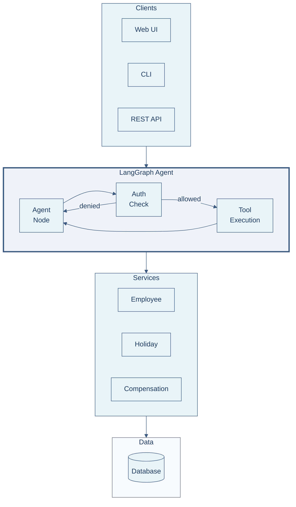
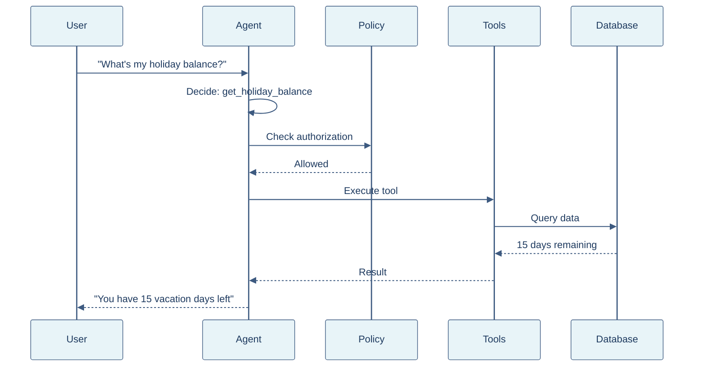
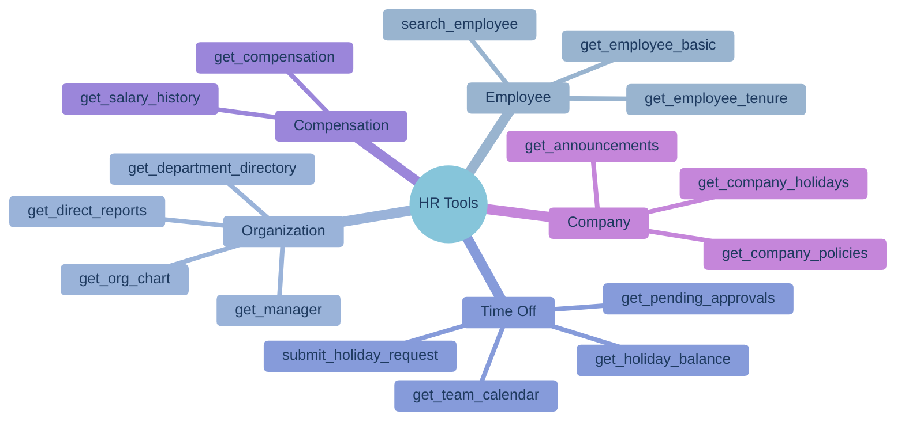

# HR Agent

<div align="center">


**A production-ready HR assistant demonstrating best practices in LLM agent design**

[Quick Start](#-quick-start) • [Architecture](#-architecture) • [Features](#-key-features) • [Evaluation](#-evaluation)

</div>

---

## 🚀 Quick Start

```bash
# Clone and setup
git clone <repository-url>
cd hr-agent
python -m venv .venv
source .venv/bin/activate
pip install -r requirements.txt

# Configure
cp .env.example .env
# Edit .env with your LLM API key

# Run the Web UI
streamlit run app.py
```

---

## ✨ Key Features

| Feature | Description |
|---------|-------------|
| 🔄 **LangGraph Workflow** | Stateful agent with conditional routing and checkpointing |
| 🛠️ **LangChain Tools** | 25 HR tools with Pydantic validation |
| 📊 **LangSmith Tracing** | Full observability, debugging, and experiment tracking |
| 🔐 **Policy Authorization** | Declarative YAML-based access control |
| 🧪 **Evaluation Framework** | 40+ test cases with automated scoring |

---

## 🏗️ Architecture



### How It Works



---

## 📁 Project Structure

```
hr-agent/
├── 📄 app.py                    # Streamlit Web UI
├── 📄 run_evals.py              # Evaluation runner
│
├── 📁 src/hr_agent/
│   ├── 📁 core/
│   │   ├── langgraph_agent.py   # LangGraph workflow
│   │   └── policy_engine.py     # Authorization
│   │
│   ├── 📁 services/
│   │   ├── langchain_tools.py   # 25 LangChain tools
│   │   └── base.py              # Service classes
│   │
│   ├── 📁 repositories/         # Data access layer
│   ├── 📁 api/                  # REST API (FastAPI)
│   └── 📁 policies/             # YAML auth rules
│
└── 📁 evals/                    # Evaluation framework
```

---

## 🧪 Evaluation

```bash
# Quick test (10 cases)
python run_evals.py --quick --verbose

# Full evaluation
python run_evals.py

# Filter by category
python run_evals.py --category time_off
```

### Sample Output

```
======================================================================
  📊 EVALUATION RESULTS
======================================================================
  Total Cases:      40
  Passed:           38 / 40
  Pass Rate:        95.0%

  Accuracy Metrics
  ----------------------------------------
  Tool Selection     97.5%
  Answer Quality     95.0%
  Authorization      100.0%
======================================================================
```

---

## 🛠️ Available Tools



---

## ⚙️ Configuration

```bash
# .env

# LLM Provider
LLM_PROVIDER=openai_compatible
LLM_API_KEY=sk-...
LLM_MODEL=gpt-4o-mini

# Optional: LangSmith Tracing
LANGSMITH_TRACING=true
LANGSMITH_API_KEY=lsv2_pt_...
LANGSMITH_PROJECT=hr-agent
```

---

## 📚 Documentation

| Document | Description |
|----------|-------------|
| [ARCHITECTURE.md](ARCHITECTURE.md) | Technical architecture, diagrams, design decisions |
| [EVALUATION.md](EVALUATION.md) | Evaluation framework, metrics, test cases |

---

## 📄 License

MIT
