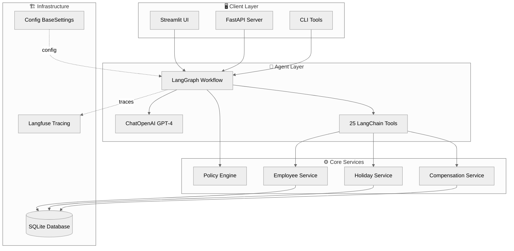
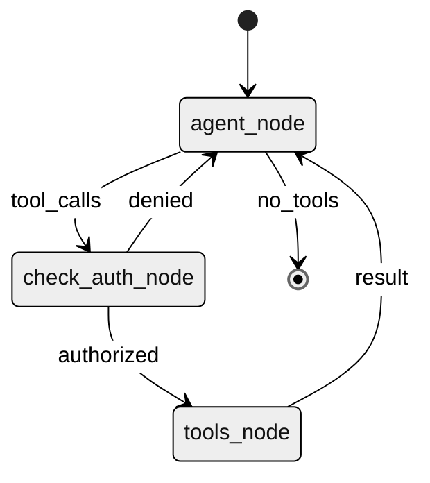
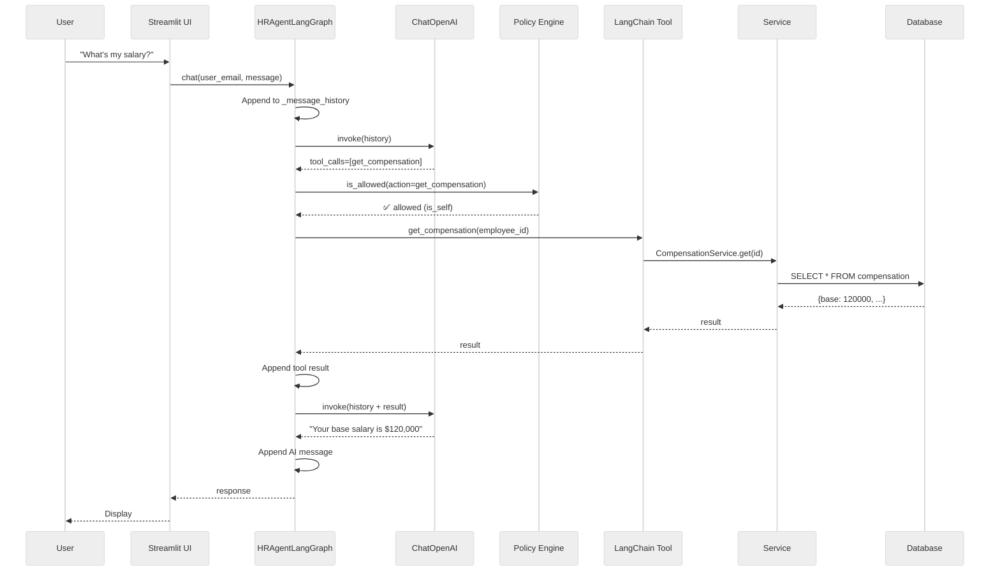

# HR Agent Architecture

> A production-ready, enterprise-grade HR assistant built with LangGraph, featuring secure policy-based authorization and comprehensive observability.

## Table of Contents

- [System Overview](#system-overview)
- [Core Components](#core-components)
- [LangGraph Agent Flow](#langgraph-agent-flow)
- [Policy Engine](#policy-engine)
- [Observability](#observability)
- [Data Layer](#data-layer)
- [Design Decisions](#design-decisions)

---

## System Overview



---

## Core Components

### 1. LangGraph Agent (`hr_agent/agent/langgraph_agent.py`)

**Purpose**: Stateful conversation orchestration with tool calling and authorization.

**Key Features**:
- **Message History Management**: Maintains `_message_history` list to preserve context across turns
- **Cached LLM**: Single bound LLM instance (ChatOpenAI + 25 tools) cached at module level
- **Streaming Support**: Both `chat()` and `chat_stream()` methods with Langfuse integration
- **Authorization Integration**: Every tool call passes through policy check before execution

**Graph Structure**:


**Node Details**:
- **agent_node**: LLM decides what tools to call
- **check_auth_node**: Policy engine validates each tool call against YAML rules
- **tools_node**: Executes authorized tools and returns results

---

### 2. Policy Engine (`hr_agent/policies/policy_engine.py`)

**Purpose**: Declarative, secure authorization system inspired by Open Policy Agent (OPA).

**Security Fix**: Replaced unsafe `eval()` with safe condition evaluators dictionary.

#### Condition Evaluators

```python
CONDITION_EVALUATORS = {
    "True": lambda ctx, helpers: True,
    "is_self": lambda ctx, helpers: ctx.requester_id == ctx.target_id,
    "is_manager": lambda ctx, helpers: ctx.requester_role in ("MANAGER", "HR"),
    "is_hr": lambda ctx, helpers: ctx.requester_role == "HR",
    "is_finance": lambda ctx, helpers: ctx.requester_role == "FINANCE",
    "is_direct_report": lambda ctx, helpers: helpers["is_direct_report"](...),
    "is_manager and is_direct_report": ...,
}
```

#### Rule Structure (YAML)

```yaml
- name: "view_own_compensation"
  description: "Employees can view their own compensation"
  effect: "allow"
  priority: 10
  actions:
    - get_compensation
    - get_salary_history
  condition: "is_self"
```

**Action Scoping**: Each rule specifies which tool names it governs via the `actions` list. Rules only evaluate when the action matches.

**Authorization Flow**:
1. Filter rules by action name
2. Evaluate conditions in priority order (high → low)
3. First matching rule determines outcome (allow/deny)
4. Default: deny if no rules match

---

### 3. LangChain Tools (`hr_agent/tools/langchain_tools.py`)

**25 Tools Organized by Domain**:

| Category | Tools | Description |
|----------|-------|-------------|
| **Employee** | `search_employee`, `get_employee_basic`, `get_employee_tenure` | Search and view employee info |
| **Organization** | `get_manager`, `get_direct_reports`, `get_org_chart`, `get_department_directory` | Org structure navigation |
| **Time Off** | `get_holiday_balance`, `submit_holiday_request`, `approve_holiday_request`, `get_team_calendar` | Holiday management |
| **Compensation** | `get_compensation`, `get_salary_history`, `get_team_compensation_summary` | Salary info |
| **Company** | `get_company_policies`, `get_announcements`, `get_company_holidays` | Public company info |

**Tool Definition Pattern**:
```python
from langchain.tools import tool

@tool
def get_holiday_balance(employee_id: int, year: int) -> dict:
    """Get the holiday balance for an employee.

    Args:
        employee_id: The ID of the employee
        year: The year to get balance for

    Returns:
        Dictionary with entitlement, used, remaining
    """
    # Pydantic validates args automatically
    service = get_holiday_service()
    return service.get_balance(employee_id, year)
```

---

### 4. Service Layer (`hr_agent/services/base.py`)

**Purpose**: Business logic and singleton service instances.

**Services**:
- `EmployeeService`: Employee data and search
- `HolidayService`: Time-off requests and approvals
- `CompensationService`: Salary and bonus info

**Singleton Pattern**:
```python
_employee_service: EmployeeService | None = None

def get_employee_service() -> EmployeeService:
    global _employee_service
    if _employee_service is None:
        _employee_service = EmployeeService()
    return _employee_service
```

---

### 5. Repository Layer (`hr_agent/repositories/`)

**Purpose**: SQLAlchemy-based data access with connection pooling.

**Pattern**:
```python
class EmployeeRepository(BaseRepository):
    def get_by_id(self, employee_id: int) -> dict | None:
        with self.engine.begin() as conn:
            result = conn.execute(
                text("SELECT * FROM employee WHERE employee_id = :id"),
                {"id": employee_id}
            ).mappings().fetchone()
            return dict(result) if result else None
```

**Repositories**:
- `EmployeeRepository`
- `HolidayRepository`
- `CompensationRepository`
- `CompanyRepository`

---

## LangGraph Agent Flow

### Request Flow



### Conversation Memory

**Implementation**: In-memory list maintained in `HRAgentLangGraph` instance.

```python
class HRAgentLangGraph:
    def __init__(self):
        self._message_history: list[BaseMessage] = []

    def chat(self, user_email: str, message: str) -> str:
        # Append user message
        self._message_history.append(HumanMessage(content=message))

        # Run graph with full history
        result = self.graph.invoke({
            "messages": self._message_history,
            "user_email": user_email,
        })

        # Append AI response
        self._message_history.append(result["messages"][-1])
        return result["messages"][-1].content
```

**Benefits**:
- Simple: No external checkpointer needed
- Fast: In-memory access
- Stateful: Full context preserved across turns

---

## Policy Engine

### Rule Evaluation

**Priority-Based Matching**:
1. Rules sorted by priority (highest first)
2. Only rules with matching `actions` are considered
3. First rule whose condition evaluates to `True` wins
4. Effect determines outcome: `allow` or `deny`

### Example Scenarios

#### Self-Access (Employee → Own Data)
```yaml
- name: "view_own_compensation"
  actions: [get_compensation]
  condition: "is_self"
  effect: "allow"
  priority: 10
```
**Result**: ✅ Employee can view their own salary

#### Cross-User Access (Employee → Other's Data)
No matching rule with `is_self` → **Result**: ❌ Denied

#### HR Access (HR → Any Employee)
```yaml
- name: "hr_view_any_compensation"
  actions: [get_compensation, get_salary_history]
  condition: "is_hr"
  effect: "allow"
  priority: 30
```
**Result**: ✅ HR can view anyone's compensation

---

## Observability

### Langfuse Integration

**Setup** (`hr_agent/configs/config.py`):
```python
from langfuse.callback import CallbackHandler

def get_langfuse_handler() -> CallbackHandler | None:
    if not settings.langfuse_enabled:
        return None
    return CallbackHandler(
        public_key=settings.langfuse_public_key,
        secret_key=settings.langfuse_secret_key,
        host=settings.langfuse_host,
    )
```

**Agent Integration** (`langgraph_agent.py`):
```python
def chat(self, user_email: str, message: str) -> str:
    handler = get_langfuse_handler()
    callbacks = [handler] if handler else []

    result = self.graph.invoke(
        state,
        config={
            "callbacks": callbacks,
            "metadata": {
                "user_email": user_email,
                "session_id": self.session_id,
            }
        }
    )
```

**What Gets Traced**:
- LLM calls (prompt, response, tokens, latency)
- Tool executions (args, results, errors)
- Agent decisions (routing, conditions)
- Full conversation sessions

---

## Data Layer

### Database Schema

```sql
-- Core tables
employee (employee_id, legal_name, email, role, manager_id, ...)
manager_reports (manager_employee_id, report_employee_id)
holiday_balance (employee_id, year, entitlement, used, ...)
holiday_request (request_id, employee_id, start_date, status, ...)
compensation (employee_id, base_salary, bonus, ...)
company_holiday (holiday_id, name, date, ...)
```

### Connection Management

**Engine Creation** (`hr_agent/utils/db.py`):
```python
from sqlalchemy import create_engine

_engine = None

def get_engine():
    global _engine
    if _engine is None:
        _engine = create_engine(
            settings.db_url,
            pool_pre_ping=True,
            pool_size=5,
        )
    return _engine
```

---

## Design Decisions

### 1. Why Langfuse over LangSmith?

| Criterion | Langfuse | LangSmith |
|-----------|----------|-----------|
| **Cost** | Free tier, open-source | Paid service |
| **Deployment** | Self-hostable | Cloud only |
| **Integration** | Simple callback handler | Requires project setup |

**Decision**: Langfuse for free tier, open-source option, and simpler setup.

### 2. Why uv over pip?

| Feature | uv | pip |
|---------|-----|-----|
| **Speed** | 10-100x faster | Baseline |
| **Lockfile** | `uv.lock` deterministic | `requirements.txt` loose |
| **Resolver** | Modern SAT solver | Legacy backtracking |
| **Docker** | Single-stage, efficient | Multi-stage required |

**Decision**: uv for speed, deterministic builds, and modern tooling.

### 3. Why Safe Evaluators over eval()?

**Before (Insecure)**:
```python
eval(condition)  # "is_self" → NameError (silently caught)
```

**After (Secure)**:
```python
CONDITION_EVALUATORS[condition](ctx, helpers)
```

**Benefits**:
- ✅ No arbitrary code execution
- ✅ Explicit, auditable conditions
- ✅ Type-safe with autocompletion
- ✅ Easy to test and debug

### 4. Why In-Memory History over Checkpointer?

**Tradeoffs**:

| Approach | Pros | Cons |
|----------|------|------|
| **In-memory** (current) | Simple, fast, no external deps | Lost on restart |
| **Checkpointer** | Persistent across restarts | Adds complexity, external store |

**Decision**: In-memory for demo simplicity. Use checkpointer for production if restart persistence is needed.

### 5. Why Action-Scoped Rules?

**Problem**: Without scoping, a rule like `condition: "True"` would allow *everything*.

**Solution**: Each rule has an `actions` list:
```yaml
- name: "view_company_holidays"
  actions: [get_company_holidays]  # Only applies to this action
  condition: "True"  # Safe because scoped
```

**Benefit**: Fine-grained control without overly permissive rules.

---

## File Organization

```
hr_agent/
├── agent/                      # LangGraph workflow
│   └── langgraph_agent.py
│
├── policies/                   # Authorization rules
│   ├── policy_engine.py
│   └── policies.yaml
│
├── tools/                      # LangChain tool wrappers
│   └── langchain_tools.py
│
├── services/                   # Business logic
│   └── base.py
│
├── repositories/               # Data access
│   ├── employee.py
│   ├── holiday.py
│   └── compensation.py
│
├── configs/                    # BaseSettings + Langfuse
│   └── config.py
│
├── tracing/                    # Logger, metrics
│   └── observability.py
│
└── utils/                      # Cross-cutting helpers
    ├── db.py
    ├── errors.py
    └── security.py
```

---

## Testing

### Policy Engine Tests

```python
def test_self_access():
    engine = PolicyEngine()
    ctx = PolicyContext(
        requester_id=1,
        requester_email="alex@acme.com",
        requester_role="EMPLOYEE",
        target_id=1,
        action="get_holiday_balance",
    )
    assert engine.is_allowed(ctx) is True

def test_cross_user_deny():
    ctx = PolicyContext(
        requester_id=1,
        requester_email="alex@acme.com",
        requester_role="EMPLOYEE",
        target_id=2,
        action="get_compensation",
    )
    assert engine.is_allowed(ctx) is False
```

### Integration Tests

```bash
uv run pytest tests/
```

---

## Deployment

### Docker

```bash
# Build
docker build -t hr-agent .

# Run with docker-compose
docker-compose up
```

**Dockerfile Highlights**:
- Uses `uv` for fast, deterministic installs
- Multi-stage: deps → app → runtime
- Non-root user for security
- Health checks on port 8000

### Environment Variables

```bash
# Required
LLM_API_KEY=...
LLM_MODEL=gpt-4o-mini

# Optional
LANGFUSE_ENABLED=true
LANGFUSE_PUBLIC_KEY=pk-...
LANGFUSE_SECRET_KEY=sk-...
```

---

## Performance Characteristics

| Operation | Latency | Notes |
|-----------|---------|-------|
| **LLM Call** | 1-3s | OpenAI API call |
| **Tool Execution** | 10-50ms | SQLite query |
| **Policy Check** | <1ms | In-memory eval |
| **Message History** | <1ms | Python list append |

**Bottleneck**: LLM inference time dominates end-to-end latency.

---

## Future Enhancements

- [ ] Add persistent checkpointer (Redis/PostgreSQL)
- [ ] Implement streaming tool calls for longer operations
- [ ] Add embedding-based semantic search for policies
- [ ] Support multi-tenant isolation
- [ ] Add GraphQL API alongside REST
- [ ] Implement caching layer (Redis) for frequent queries
- [ ] Add A/B testing framework for prompt variations

---

## References

- [LangGraph Documentation](https://langchain-ai.github.io/langgraph/)
- [Langfuse Documentation](https://langfuse.com/docs)
- [uv Documentation](https://docs.astral.sh/uv/)
- [Open Policy Agent](https://www.openpolicyagent.org/)
